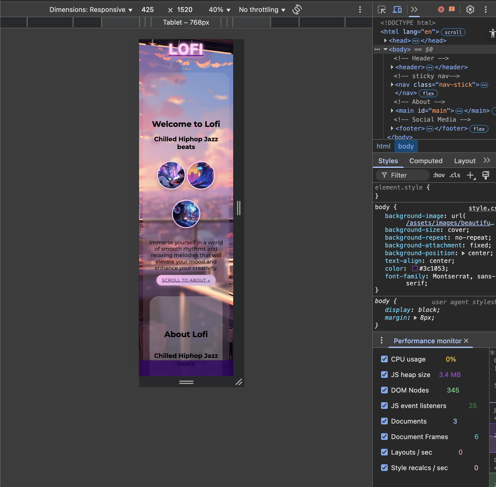
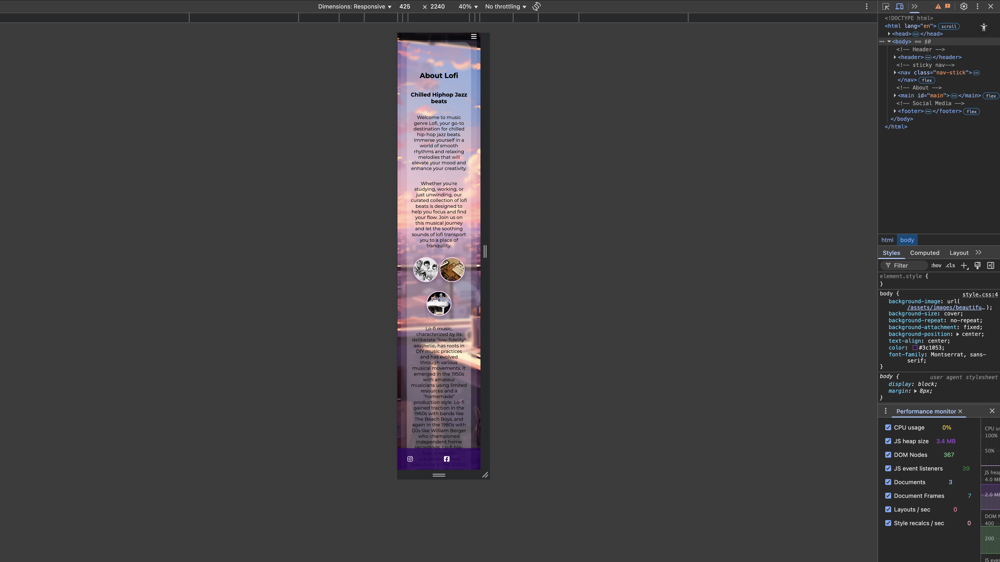
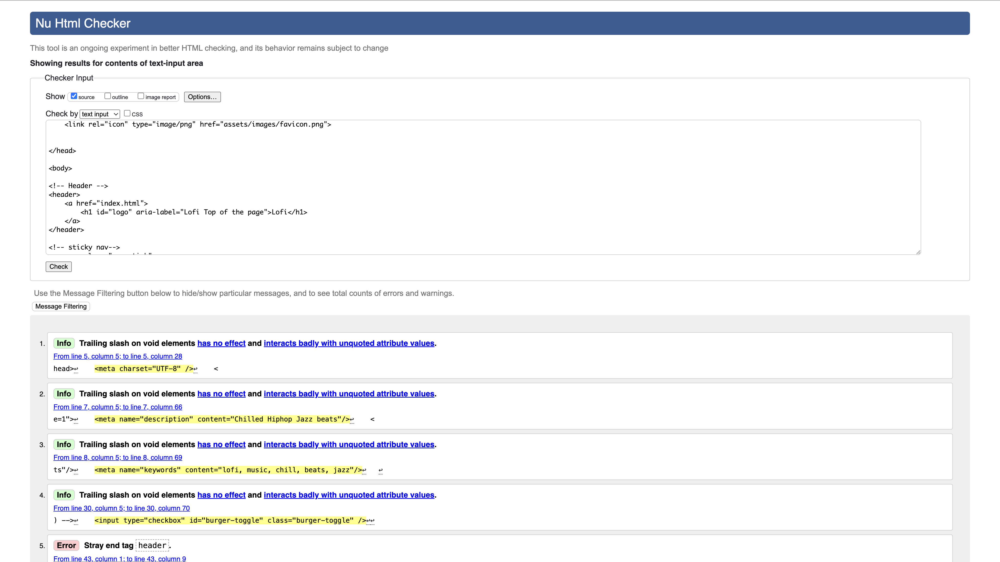
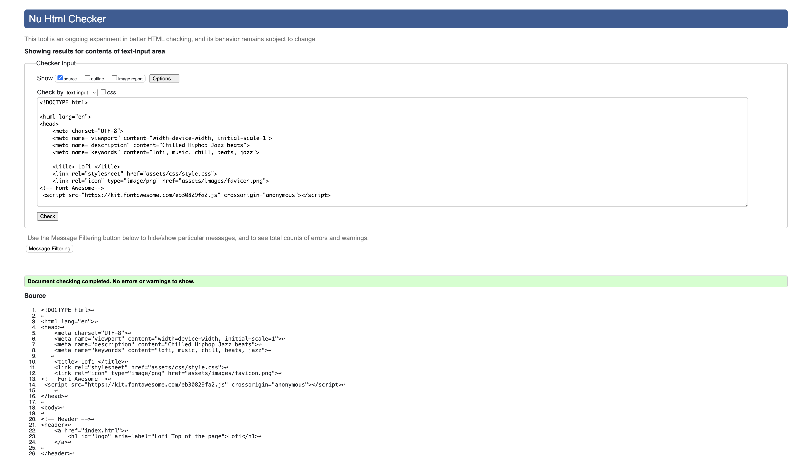
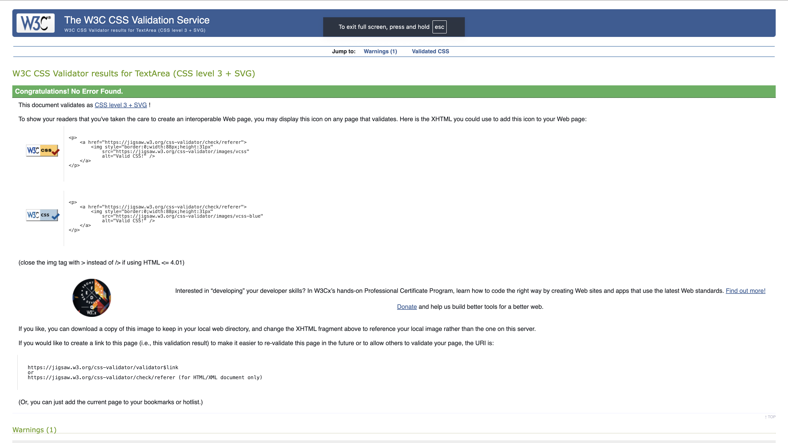

# **Lofi Music Site**
## **Site Overview**

Lofi Music is a genre of music that has become increasing popluar of the last decade. The genre of music is often used as a background music for all settings, whether it be studing, working or just relaxing. The site is designed to be simple and easy to navigate with focus on the music and the community that surrounds it.

The site is designed around the idea of what the genre Lofi is, by using palettible colours and images that are associated with the genre. No invasive animations or pop-ups, low stimulation and a playlist of various focus music from youtube.

The site is include 3 sections:
1. **About Section** - A brief history of the genre, its evolution and its origins.
2. **Chillzone Section** -Which is made of various Lofi playlists from youtube, with a video player.
3. **Sign-up Section** - A contact form for users to sign up for a newsletter of the lastest playlists released within the Lofi community.

​
## Table of contents:
1. [**Site Overview**](#site-overview)
1. [**Planning stage**](#planning-stage)
    * [***Target Audiences***](#target-audiences)
    * [***User Stories***](#user-stories)
    * [***Site Aims***](#site-aims)
    * [***Wireframes***](#wireframes)
    * [***Color Scheme***](#color-scheme)
    * [***Typography***](#typography)
1. [**Current Features Common to all pages**](#current-features-common-to-all-pages)
    * [***Header Element***](#header-element)
    * [***Other Features***](#features)
    * [**Footer**](#footer)
1. [**Individual Page Content features**](#individual-page-content-features)
    * [**About Page Content**](#about-page-content)
    * [**Teachings Page Content**](#teachings-page-content)
    * [**Community Page Content**](#community-page-content)
    * [**Contact Page Content**](#contact-page-content)
    * [**Form Feedback Page Content**](#form-feedback-page-content)
1. [**Future-Enhancements**](#future-enhancements)
1. [**Testing Phase**](#testing-phase)
1. [**Deployment**](#deployment)
1. [**Tech**](#tech)
1. [**Credits**](#credits)
    * [**General reference**](#general-reference)
    * [**Content**](#content)
    * [**Media**](#media)
    * [**Honorable mentions**](#honorable-mentions)
​
## **Planning Stage**

 

#### **Target Audiences:**
* People interested in Lofi music or looking to find out more information on the genre​.
* Individuals of all ages finding a low stimulating beat to relax to.
* New listener looking to find out more about the genre and its origins.
* Fans of the genre looking to find new playlists and music.
* People looking for a community of like-minded individuals who share the same interests.
* Individuals looking for a place to sign up for a newsletter to keep up to date with the latest playlists and music.

​
#### **User Stories:**
* As a user, I want to browse curated Lofi playlists (e.g., study, chill, sleep), so I can find the right vibe easily
* As a casual visitor,
I want to discover what lofi music is and learn about its background,
So that I can understand the genre and appreciate the music while I listen.
* As a user, I want to listen to Lofi music without distractions, so I can focus on my tasks.
* As a user, I want to navigate the page to find what I require quickly and easily.
* As a student or remote worker, I want to access relaxing lofi music playlists, so that I can stay focused and productive while working or studying.
* As a lofi music enthusiast, I want to sign up to receive the latest updates and playlists,
So that I can stay informed and connected to the lofi community.
* As a mobile user,I want to navigate the site easily with responsive design and a burger menu, So that I can enjoy the full experience from any device.
* As a visually impaired user,I want to navigate the website using screen readers and keyboard shortcuts,So that I can fully access all content and features without needing a mouse.

​
#### **Site Aims:**
* To promote the genre of Lofi music and its origins.
* To provide a platform for users to discover and listen to Lofi music playlists.
* To provide a relaxing user experience with minimal distractions.
* To provide a platform for this genre of music, with access the lastest playlists and music within the Lofi genre.
* To encourage users to stay in contact with the Lofi community by siging up for the newletter. 
* To deliver a responsive website that is accessible to all, regardless of device or ability.

​​
#### **Wireframes:**

Wireframes for each section were created using Balsamiq. This process provided a basic but clear outline of how each section would look as well as organising the content.

* Welcome Section
[Desktop view Wireframe](/documents/wireframe-desktop.png)

[Mobile view Wireframe](/documents/wireframe-mobile-device.png)

 ​

#### **Color Scheme:**
​
I used online palette generator ColorSpace to generate the following:

 

The colours used throught the site reflect the calm, nostalgic and mood associted with the genre of Lofi music. The colours are soft and non invasive, allwing the user to focus on the information and the music promoted on the site.

​
#### **Typography**
​
* Throughout the page, the following fonts are used:
  * Montserrat ('https://fonts.googleapis.com/css2?family=Montserrat:wght@100..900&display=swap') - I felt it went aesthetically with the overall design of the site and was easy to read.
  * Sans serif - Is the fallback font in the event Montserrat wasn't supported by the browser
​
* All fonts were sourced from Google fonts, as stated in the credits.

​ 

## **Current Features Common to all Pages**

#### **Favicon**

* The favicon is used to represent the the social media links in the footer of the page.
* The intention is to enhance the user experience of navigating to other platform withouth have to leave the site.

​
#### **Navigation Bar:**
​
* The navigation on smaller devices, can be found in the top right side of the header which gives the user an easily navigation experience to various sections of the site.
* The navigation bar on bigger screens, can be located at the top of the page and once the page is scrolled down. This is to give the user easy navigation across the site to various sections.
* Each navigation link features a hover effect too provide visual feedback to the user.
* Each navigation button has a hover effect to continues navigating down the one page scrolling site.

#### **Footer:**

* The footer contains social media link icons which take the user to the relevant social media page in a new tab.
* The footer is responsive and the icons all shrink on smaller screens.

​

## **Features**
​
#### **About Section** 

* Introduction to Lofi Music 
A warm and informative welcome that explains the genre’s purpose: to help users relax, focus, and enhance creativity.
* Historical Context
A brief but engaging history of lofi music, highlighting its evolution from 1950s DIY roots to modern-day lo-fi hip-hop. Key influencers such as The Beach Boys, William Berger, J Dilla, Madlib, Nujabes, and MF Doom are mentioned.
* Visual Storytelling
The section includes nostalgic and genre-relevant images (e.g., vintage studio setups and iconic artists) presented in circular frames with soft shadows, reinforcing the site’s aesthetic and musical theme.
* Smooth Transitions and Navigation 
A scroll button allows users to transition fluidly to the Chill Zone section, maintaining engagement and intuitive flow.

  

#### **Chillsone Section** 

* Curated Lofi Music Playlists
Embedded YouTube videos offer handpicked lofi tracks that users can play directly from the site. This provides instant, high-quality access to ambient music for studying, working, or relaxing.
* Highlighting Influential Artists
The section includes images and mentions of genre-defining artists like MF Doom, J Dilla, Madlib, and Nujabes, giving users cultural context and celebrating the genre’s pioneers.
* Responsive Video Grid
The video embeds are displayed in a flexible layout, ensuring they look good on all screen sizes—from desktop to mobile—thanks to responsive design techniques.
* Engaging Visual Aesthetics
Consistent with the site’s theme, the Chill Zone features soft colors, blurred backgrounds, and shadowed imagery, creating a peaceful, immersive environment.
* Fun Fact Element
Adds an engaging touch with a trivia-style fact about the longest lofi stream, making the section more memorable and appealing.
* Smooth Navigation to Sign-Up
A scroll button encourages users to move to the Sign-Up section, keeping them engaged and increasing the chance of community participation.

 

#### **Sign up Section**

* User-Friendly Form Fields
Includes clearly labeled input fields for first name, last name, and email address—making it simple for users to join the Lofi community.
* Accessible and Responsive Design
The form is fully responsive and styled with accessibility in mind, ensuring readability and usability across all devices and for users with assistive technologies.
* Stylish Visual Integration
Uses soft pastel tones, rounded borders, and a background feature of the blurred effect to match the site’s calming aesthetic while maintaining high contrast and legibility.
* Call-to-Action Button
A prominent and inviting submit button (“Let’s Get Chilln’”) encourages user interaction and adds a playful, genre-appropriate tone.
* Privacy Reassurance
Text included below the image reassures users that their information will not be shared, helping build trust and transparency.
* External Form Handling
Utilizes formdump.codeinstitute.net for backend form handling which is an effective, lightweight solution for capturing and testing form submissions without building a custom backend.
​
## **Future-Enhancements**
​
There are a number of improvements the business would like implemented going forward:
​
* User Authentication and Member Profiles
Enable users to create accounts and log in, allowing them to save favorite playlists, leave comments, or access exclusive content.
* 8 Dark/Light Theme Toggle
Add a theme switcher so users can choose between light and dark modes, enhancing accessibility and comfort during different times of day.
* Blog or News Section
Include updates on new artists, featured tracks, or events in the lofi community to increase engagement and content variety.
* Thank you landing page
A landing page that has a thank you message after the user has submitted the form.
* 404 Error Page
Create a custom 404 error page that guides users back to the home page or provides links to popular sections of the site, improving user experience in case of broken links.
* User Feedback Form
Include a contact or feedback form so users can share suggestions, report issues, or request new playlists.
​
## **Testing Phase**
​
**Responsiveness**

* Responsiveness was tested using the Chrome DevTools device toolbar, which allows testing across various screen sizes and orientations. 
* Interaction testing of the navigation bar and footer was conducted on multiple devices, including desktop, tablet, and mobile.
* Media Queries Validation
Reviewed applied breakpoints (768px, 1024px, 1600px) and confirmed expected font scaling, layout changes, and image resizing.

* **Site Page**

* 
* 

* **About Section**

* 
* 

* **Contact form page**

* 
* 

* **Contact form page**

* 
* 
​

**Functionality**

* Each feature was user-tested numerous times. All links were clicked and inages checked.
* The header is responsive and each of the links and hamburger menu function as desired. 
* The social media links within the footer all work as expected on all pages, taking the user to the relevant link in a new tab. 
* On the form on the sign up page does not allow user to submit a blank form, or a form with an invalid email address.
* The form submits successfully when all required fields are filled in correctly.
* I used *Lighthouse* to test each page. Results below:

* [Overall Site](docs/images/home-lighthouse.png)

* Each section of the site performs well with the following results:

​
**Validators**

* HTML Validation using w3c validator - Each page passed validation

* 
* 

* CSS Validation using w3c jigsaw - Each page passed validation

* 

​
​
## **Bugs**
​
The following bugs were identified during user testing:

* 🐞 - The styling sheet would not connect to the HTML file, resulting in no styles being applied.
* ⚒️ - Ensured the link to the CSS file was correct in the HTML head section.
* ✅ - The styles are now applied correctly, and the site displays as intended.

 

* 🐞 - The sticky navigation bar sometimes overlapped the top of sections when using anchor links (e.g., #about, #chillzone).
* ⚒️ - Added extra padding-top to each section or adjusted scroll-margin-top in CSS to account for the navbar height.
* ✅ - The sticky navbar now scrolls smoothly without overlapping content, ensuring a better user experience.

 

* 🐞 - The burger menu not toggling correctly on smaller screens, the burger menu was opening on the left hand side of the screen which covered the content.
* ⚒️ - Ensured the checkbox input (#burger-toggle) was correctly linked to the label and added visibility logic in the CSS :checked state.
* ✅ - The burger menu now toggles correctly, opening and closing as expected, without covering the content.

​ 

* 🐞 - Image distortion on Mobile, circular images stretched or overlapped when viewed on very small devices.
* ⚒️ - Set min/max widths and used aspect-ratio and object-fit: cover in CSS to maintain image shape and scaling. 
* ✅ - Images now maintain their circular shape and aspect ratio across all devices, ensuring a consistent look.
 

* 🐞 -  Form Styling Collapsed on Narrow Screens, the sign-up form elements stacked too tightly or overflowed their container on small screens.
* ⚒️ - Adjusted form padding, applied responsive width limits, and added box-sizing: border-box.
* ✅ - The form now displays correctly on all screen sizes, with appropriate spacing and alignment of input fields and buttons.

 

 

## **Unfixed Bugs**

* There are no known unfixed bugs at this stage but this section has been added to catalogue instances of future bugs.

## **Deployment**
I deployed the page on GitHub pages via the following procedure: -
​
1. From the project's [repository](https://github.com/Tafari-K/Lofi), go to the **Settings** tab.
2. From the left-hand menu, select the **Pages** tab.
3. Under the **Source** section, select the **Main** branch from the drop-down menu and click **Save**.
4. A message will be displayed to indicate a successful deployment to GitHub pages and provide the live link.
​
The live site can be found can be found at the following URL - 

***
​
## **Tech**
​
I used the following technologies for this project:
​
- HTML
- CSS
- JavaScript
- Google Fonts
- Font Awesome
- Git and GitHub for version control
- Chrome DevTools for testing and debugging
- W3C Validator for HTML and CSS validation
- Balsamiq for wireframing
- Favicon.io for creating the favicon

 

## **Credits**

### **General Reference:**
- [Code Institute](https://codeinstitute.net/)
- [Google Fonts](https://fonts.google.com/)
- [Font Awesome](https://fontawesome.com/)
- [W3Schools](https://www.w3schools.com/)
- [Wikipedia] (https://en.wikipedia.org/wiki/Lofi_hip_hop)
- [YouTube](https://www.youtube.com/)
- [Freepik](https://www.freepik.com/)
- [chatgpt](https://chat.openai.com/)
- [favicon.io](https://favicon.io/)

### **Media:**
- All images used in the project were sourced from [Freepik](https://www.freepik.com/) and are free to use.
​
* The following images were used, all acquired from Freepik.com:

* https://www.freepik.com/free-vector/aesthetic-lo-fi-music-youtube-channel-art_27368871.htm
* https://www.freepik.com/free-ai-image/beautiful-office-space-cartoon-style_94942448.htm#fromView=search&page=1&position=2&uuid=b0765cfd-b53f-435b-aa34-d8c5d75d5636&query=lofi

The following image were sourced from Wikipedia and are free to use:

* https://en.wikipedia.org/wiki/The_Beach_Boys#/media/File:The_Beach_Boys,_May_29,_2012.jpg
* https://en.wikipedia.org/wiki/The_Beach_Boys#/media/File:The_Beach_Boys_(1965).png
* https://en.wikipedia.org/wiki/J_Dilla#/media/File:J_Dilla_James_Yancy.jpg
* https://en.wikipedia.org/wiki/Madlib#/media/File:4C1A9262-2_(cropped).jpg
* https://en.wikipedia.org/wiki/MF_Doom#/media/File:MF_Doom_-_Hultsfred_2011_(cropped).jpg
* https://en.wikipedia.org/wiki/Nujabes#/media/File:Nujabes_performing_live.jpg
* https://en.wikipedia.org/wiki/Lo-fi_music#/media/File:Will_this_lo-fi_studio_work?.jpg
* 

### **Honorable mentions**
* A special thanks to my mentor Richard for his feedback and encouragement along the different stages of creating this page.
* Thanks to Code Institute for providing the resources and support to complete this project.